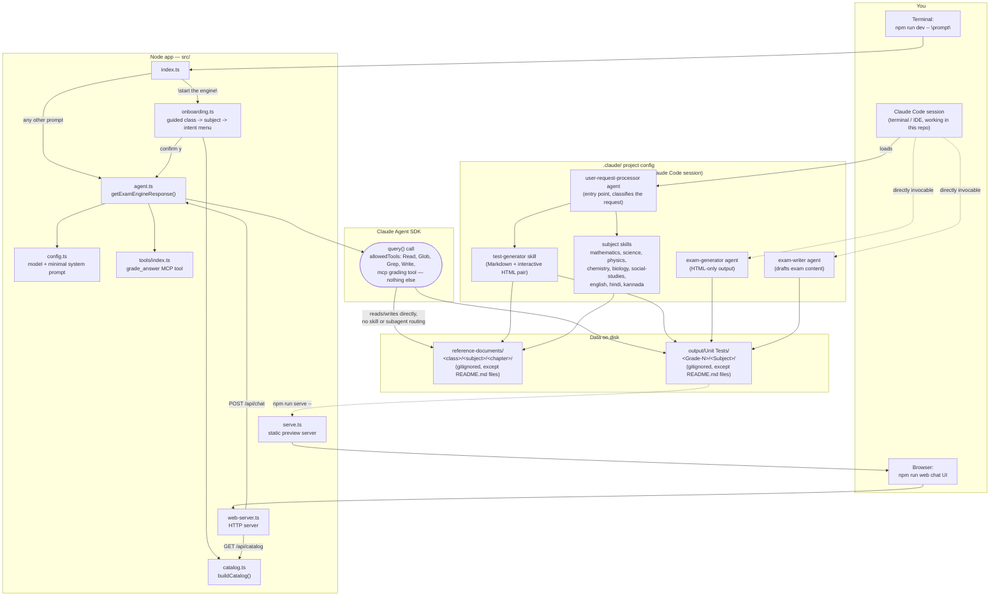

# Architecture

exam-engine has two **independent** ways of turning a request into exam content. They share the same `reference-documents/` and `output/Unit Tests/` folders on disk, but neither one calls the other — that split is the single most important thing to understand about this repo before making changes.

1. **The Node app** (`src/`) — a small bundled Claude agent with its own minimal system prompt, reachable via the CLI (`npm run dev`) or the web chat (`npm run web`). It only knows how to `Read`/`Glob`/`Grep`/`Write` and call one grading tool — it has no awareness of `.claude/agents/` or `.claude/skills/`.
2. **Claude Code itself**, working directly in this repo (a terminal/IDE session like the one that generated files under `output/Unit Tests/`) — this is what actually reads `.claude/agents/*.md` and `.claude/skills/*/SKILL.md`, and is the only path with subject-specific grounding rules, the test-generator's HTML/Markdown pipeline, etc.

## Diagram

## Component reference

Node app (`src/`):
- [src/index.ts](src/index.ts) — CLI entry point; routes `"start the engine"` to onboarding, everything else straight to the agent.
- [src/onboarding.ts](src/onboarding.ts) — interactive class/subject/intent menu; only calls the agent on explicit confirmation.
- [src/catalog.ts](src/catalog.ts) — scans `reference-documents/` for the class/subject folders that exist; shared by onboarding and `/api/catalog`.
- [src/agent.ts](src/agent.ts) — wraps the SDK `query()` call with this project's model/tools/system prompt.
- [src/config.ts](src/config.ts) — model choice and the (deliberately minimal) system prompt/grounding instruction.
- [src/tools/index.ts](src/tools/index.ts) — the one custom MCP tool (`grade_answer`).
- [src/web-server.ts](src/web-server.ts) — dependency-free HTTP server for the chat UI.
- [src/serve.ts](src/serve.ts) — static file server for previewing a generated interactive HTML report (`npm run serve`).

Claude Code project config (`.claude/`), active only inside a Claude Code session:
- [.claude/agents/user-request-processor.md](.claude/agents/user-request-processor.md) — classifies each request and dispatches to the matching skill.
- [.claude/agents/exam-generator.md](.claude/agents/exam-generator.md) / [.claude/agents/exam-writer.md](.claude/agents/exam-writer.md) — narrower agents invoked directly rather than through the processor.
- [.claude/skills/test-generator/SKILL.md](.claude/skills/test-generator/SKILL.md) — the Markdown + interactive HTML test/exam pipeline.
- `.claude/skills/<subject>/SKILL.md` — one skill per subject, each grounded strictly in its own `reference-documents/<class>/<subject>/`.

Data:
- `reference-documents/<class>/<subject>/<chapter>/` — source material; not committed (only `README.md`s are).
- `output/Unit Tests/<Grade-N>/<Subject>/` — generated question papers, answer keys, and interactive HTML pages, organized by grade (`Grade-7` … `Grade-12`) then subject (`Mathematics`, `Science`, `English`, `Social Studies`, `Hindi`, plus any other subject created on demand); not committed except `README.md`.

## Why the split matters

If you're extending grounding rules, subject coverage, or the HTML template, that all lives under `.claude/skills/` and only affects Claude Code sessions working directly in this repo — it will **not** change what the deployed CLI or web chat produces, because [src/agent.ts](src/agent.ts) never loads it. Conversely, changes to `src/config.ts`'s system prompt affect the Node app only. Keeping both in sync (if that's ever the goal) is a manual, deliberate step, not automatic.
